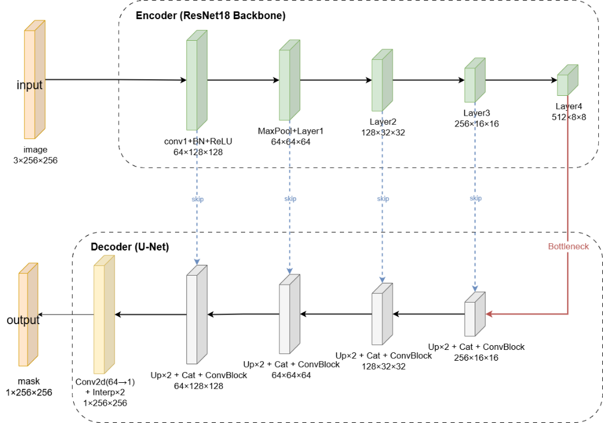
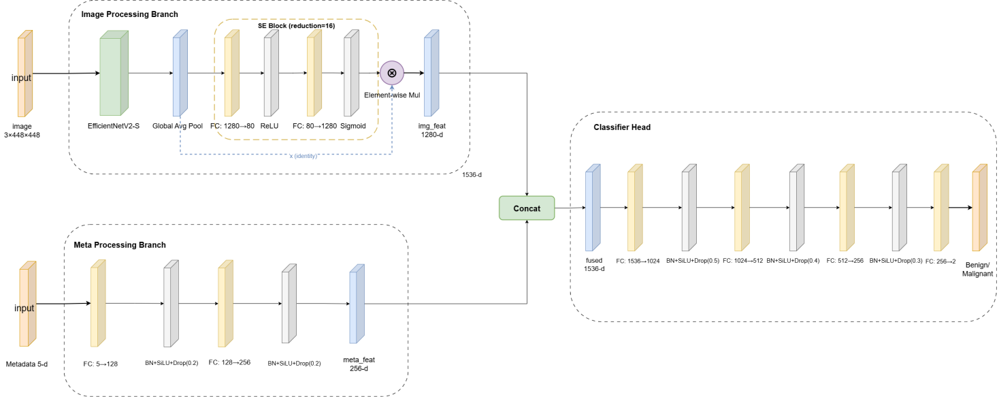
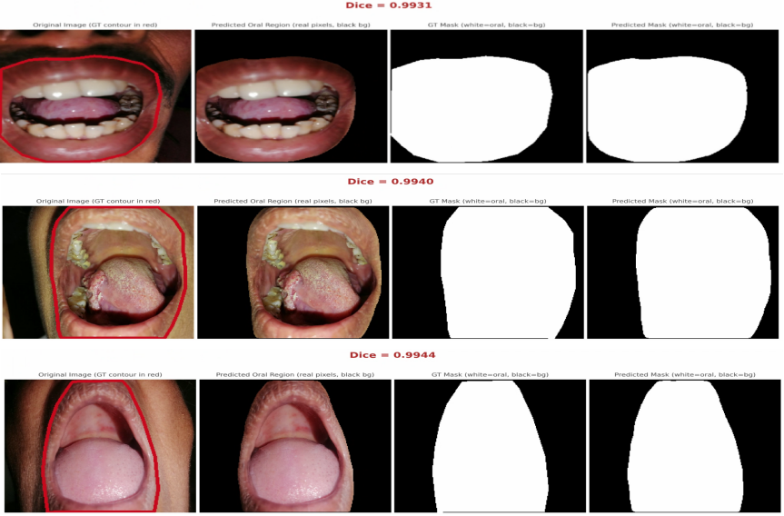
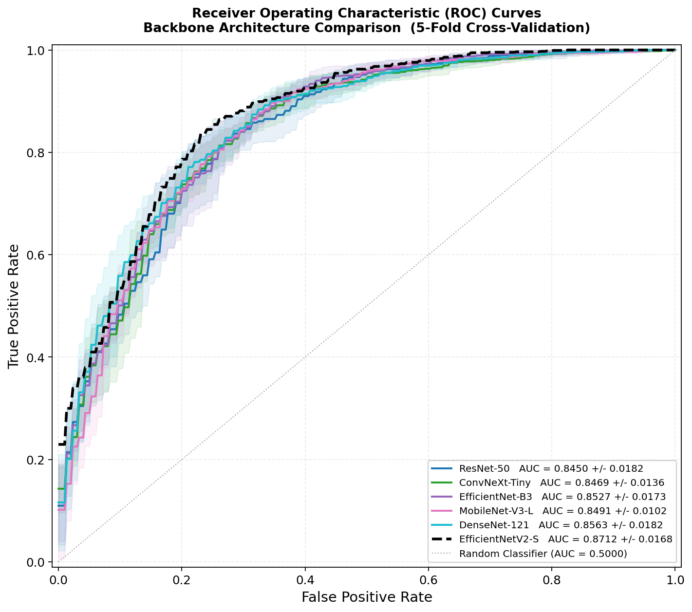
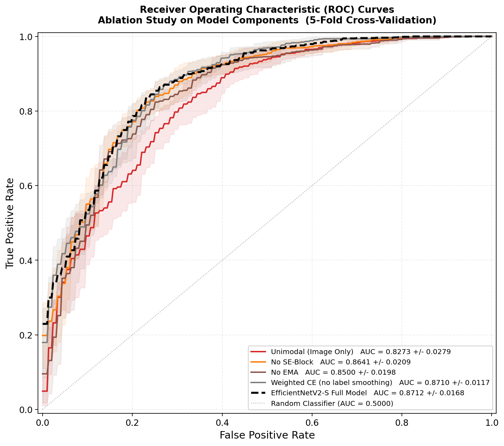
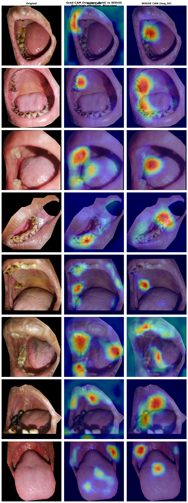
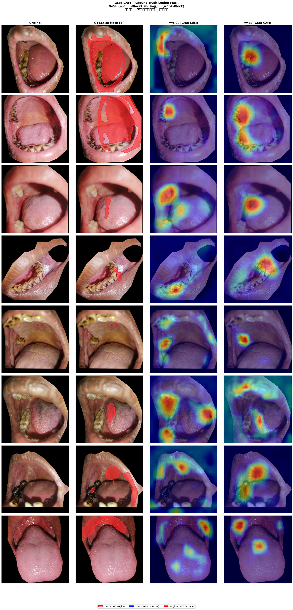

# Multimodal Recognition of Oral Cancer Integrating SE Attention and Metadata

> 侯宇欣, 徐睿杰, 韩俊杰, 赵奎璋, 查鑫悦, 张琥, 吴贯锋. 融合SE注意力与元数据的口腔癌多模态识别[J].

## Abstract

A two-stage multimodal diagnostic pipeline for oral cancer screening. Stage 1 uses **ResNet18-UNet** to extract the oral region of interest (ROI) from clinical images, achieving a mean **Dice of 0.9700**. Stage 2 employs **EfficientNetV2-S** with a **Squeeze-and-Excitation (SE)** channel recalibration module for image feature extraction, fused with structured clinical metadata (age, gender, smoking, betel quid chewing, alcohol use) via **Concatenation**. Training is stabilized with **Exponential Moving Average (EMA)** and **Weighted Label Smoothing** loss.

On an independent test set under patient-level 5-fold cross-validation, the full model achieves **Accuracy 0.8281**, **Macro F1 0.7969**, **MCC 0.5944**, and **AUC 0.8712**, outperforming the baseline method by 1.81%, 1.69%, and 2.44% in accuracy, macro F1, and MCC respectively.

---

## Method

### Overall Pipeline

```
Raw Oral Image (any size) + Clinical Metadata (5-dim)
        |                          |
        v                          |
Stage 1: ResNet18-UNet             |
  - Multi-scale feature extraction |
  - Skip-connection fusion         |
  - Sigmoid output (256x256 mask)  |
        |                          |
        v                          |
ROI Preprocessing:                 |
  - Mask x Image -> oral ROI       |
  - Resize to 448x448              |
  - ImageNet normalization         |
        |                          |
        v                          v
Stage 2: Multimodal Classification (see Fig.2 below)
        |
        v
  Benign / Malignant
```

### Stage 1: Oral Region Segmentation

ResNet18-UNet encoder-decoder with ImageNet-pretrained ResNet18 backbone. The encoder captures multi-scale features through 5 downsampling stages; the decoder restores spatial detail via bilinear upsampling and skip connections. Trained with **Dice-BCE** combined loss to address foreground-background class imbalance.



### Stage 2: Multimodal Classification

Four submodules:

1. **Image Feature Extraction + SE Recalibration**: EfficientNetV2-S (1280d output) followed by SEBlock that applies channel-wise gating — `x_out = x * sigmoid(FC(ReLU(FC(x))))` — to emphasize diagnostically relevant feature dimensions.
2. **Metadata Encoding**: MetaMLP (5->128->256 with BatchNorm + SiLU + Dropout) maps the 5-dim clinical vector to a 256-dim representation.
3. **Fusion**: Concatenation combines image features (1280d) and metadata features (256d) into a joint 1536-dim representation.
4. **Classification Head**: FC (1536->1024->512->256->2) with BatchNorm + SiLU + Dropout produces the benign/malignant logits.

Unlike the original SE module designed for 2D feature maps, our SE operates directly on the 1D global feature vector from EfficientNetV2-S, requiring no global average pooling.



### Training Strategy

**Weighted Label Smoothing Loss** (Eq. 8-9 in paper):

Given class imbalance (benign >> malignant), class weights `w = [2.0, 1.0]` penalize benign misclassification more heavily. Label smoothing (`smoothing = 0.05`) converts hard one-hot targets to soft targets, preventing overconfidence:

```
L = -mean( sum( true_dist * log_softmax(pred), dim=1 ) )
```
where `true_dist = (1-smoothing) * one_hot + smoothing/(C-1)`, weighted by class weights.

**Exponential Moving Average (EMA)**:

Shadow weights are maintained with `decay = 0.99`, updated each optimizer step. The first 5 epochs serve as a warmup period without EMA updates. At inference time (and validation after warmup), shadow weights replace model weights to reduce parameter variance.

**Optimization**: AdamW (`lr=2e-4`, `wd=2e-3`) + CosineAnnealingLR (`T_max=100`, `eta_min=5e-7`). Gradient clipping at `max_norm=2.0`. Gradient accumulation over 3 steps yields an effective batch size of 48.

---

## Experimental Setup

### Dataset

The **Dataset of Annotated Oral Cavity Images for Oral Cancer Detection** by Piyarathne et al. (2024) contains ~3,000 clinical oral cavity images with:
- Oral region and lesion segmentation annotations
- Patient metadata: Age, Gender, Smoking, Chewing Betel Quid, Alcohol
- Three original categories: Benign, OPMD (Oral Potentially Malignant Disorders), OCA (Oral Cancer)

OPMD and OCA are merged into a single **Malignant** class for binary classification.

**Images are not included** in this repository. Obtain from:

> Piyarathne N S, Liyanage S N, Rasnayaka R M S G K, et al. A comprehensive dataset of annotated oral cavity images for diagnosis of oral cancer and oral potentially malignant disorders[J]. Oral Oncology, 2024, 156: 106946.

### Data Split

**Patient-level stratified sampling**: 15% of patients held out as a fixed test set; remaining 85% split into 5 folds with stratification. This prevents data leakage where multiple images from the same patient appear in both train and test sets.

### Table 1: Training Configuration

| Parameter | Value |
|---|---|
| Training Device | NVIDIA A100 GPU |
| Random Seed | 42 |
| Input Image Size | 448 x 448 |
| Batch Size | 16 |
| Gradient Accumulation Steps | 3 |
| Max Epochs | 100 |
| Early Stop Patience | 20 |
| Optimizer | AdamW |
| Initial Learning Rate | 2 x 10^-4 |
| Weight Decay | 2 x 10^-3 |
| LR Schedule | CosineAnnealingLR |
| Min Learning Rate | 5 x 10^-7 |
| EMA Decay | 0.99 |
| EMA Warmup Epochs | 5 |
| Label Smoothing | 0.05 |
| Class Weights | [2.0, 1.0] |

### Data Augmentation

Training only: Random H/V flip (p=0.5), rotation (+-20 deg), affine translation (0.1) and scale (0.9-1.1), color jitter (brightness 0.2, contrast 0.2, saturation 0.15, hue 0.05), random grayscale (p=0.1).

### Evaluation Metrics

- **Accuracy**: overall correct predictions
- **Precision / Recall**: malignant-class precision and sensitivity
- **Macro F1**: harmonic mean of macro-averaged precision and recall
- **MCC** (Matthews Correlation Coefficient): robust to class imbalance
- **AUC**: area under the ROC curve, threshold-independent ranking quality

### Inference

**Threshold search** over [0.15, 0.95] maximizes balanced accuracy on validation set. **TTA**: 3-way flip averaging (original, horizontal flip, vertical flip) at test time.

---

## Results

Experiments follow the progressive logic: **backbone selection -> fusion strategy -> ablation analysis**.

### Segmentation Results

ResNet18-UNet achieves mean Dice = **0.9700** on 300 test samples, validating that predicted masks align closely with expert annotations even under boundary complexity and variable imaging conditions.



### Table 2: Backbone Comparison

Fixed configuration: SE attention + MetaMLP + Concat fusion. Only the image backbone varies.

| Backbone | Accuracy | Precision | Recall | Macro F1 | MCC | AUC |
|---|---|---|---|---|---|---|
| **EfficientNetV2-S** | **0.8281 +- 0.0153** | **0.8818 +- 0.0112** | **0.8714 +- 0.0173** | **0.7969 +- 0.0175** | **0.5944 +- 0.0346** | **0.8712 +- 0.0168** |
| EfficientNet-B3 | 0.8150 +- 0.0140 | 0.8555 +- 0.0129 | 0.8857 +- 0.0261 | 0.7740 +- 0.0156 | 0.5514 +- 0.0321 | 0.8527 +- 0.0173 |
| DenseNet121 | 0.8012 +- 0.0215 | 0.8745 +- 0.0130 | 0.8366 +- 0.0380 | 0.7698 +- 0.0203 | 0.5435 +- 0.0388 | 0.8563 +- 0.0182 |
| MobileNetV3-Large | 0.7956 +- 0.0100 | 0.8709 +- 0.0248 | 0.8339 +- 0.0453 | 0.7617 +- 0.0106 | 0.5312 +- 0.0184 | 0.8491 +- 0.0102 |
| ConvNeXt-Tiny | 0.7919 +- 0.0305 | 0.8808 +- 0.0152 | 0.8143 +- 0.0660 | 0.7632 +- 0.0236 | 0.5377 +- 0.0352 | 0.8469 +- 0.0136 |
| ResNet50 | 0.7900 +- 0.0280 | 0.8716 +- 0.0175 | 0.8223 +- 0.0577 | 0.7585 +- 0.0235 | 0.5259 +- 0.0488 | 0.8450 +- 0.0102 |

**Finding**: EfficientNetV2-S achieves the best overall performance. While EfficientNet-B3 has marginally higher Recall (0.8857), its Accuracy and MCC drop noticeably, indicating a precision-recall trade-off. EfficientNetV2-S is selected as the default backbone for all subsequent experiments.



### Table 3: Fusion Strategy Comparison

Fixed EfficientNetV2-S backbone. Five fusion strategies compared.

| Fusion Method | Accuracy | Precision | Recall | Macro F1 | MCC | AUC |
|---|---|---|---|---|---|---|
| **Concat** | **0.8281 +- 0.0153** | **0.8818 +- 0.0112** | **0.8714 +- 0.0173** | **0.7969 +- 0.0175** | **0.5944 +- 0.0346** | **0.8712 +- 0.0168** |
| Gated Multimodal Fusion | 0.8231 +- 0.0208 | 0.8847 +- 0.0152 | 0.8598 +- 0.0332 | 0.7932 +- 0.0217 | 0.5888 +- 0.0418 | 0.8728 +- 0.0218 |
| Multi-Task Learning | 0.8137 +- 0.0317 | 0.8865 +- 0.0050 | 0.8420 +- 0.0554 | 0.7857 +- 0.0284 | 0.5774 +- 0.0504 | 0.8742 +- 0.0101 |
| Bidirectional Cross-Attention | 0.8044 +- 0.0127 | 0.8859 +- 0.0117 | 0.8277 +- 0.0323 | 0.7762 +- 0.0095 | 0.5585 +- 0.0174 | 0.8629 +- 0.0152 |
| Element-wise Addition | 0.7981 +- 0.0200 | 0.8825 +- 0.0218 | 0.8232 +- 0.0548 | 0.7687 +- 0.0144 | 0.5470 +- 0.0212 | 0.8485 +- 0.0126 |

**Finding**: Simple Concatenation achieves the best overall performance. While Multi-Task Learning yields the highest AUC (0.8742), its Accuracy and MCC are lower. Gated Fusion shows competitive MCC (0.5888) and AUC (0.8728) but does not surpass Concat. Element-wise Addition performs worst, suggesting that lossless feature preservation is important for this task.

### Table 4: Ablation Study

Each component of the full model is removed to measure its independent contribution.

| Experiment | Accuracy | Precision | Recall | Macro F1 | MCC | AUC |
|---|---|---|---|---|---|---|
| **Full Model** | **0.8281 +- 0.0153** | **0.8818 +- 0.0112** | **0.8714 +- 0.0173** | **0.7969 +- 0.0175** | **0.5944 +- 0.0346** | **0.8712 +- 0.0168** |
| Weighted CE (no label smoothing) | 0.8125 +- 0.0217 | 0.8856 +- 0.0228 | 0.8429 +- 0.0537 | 0.7827 +- 0.0186 | 0.5741 +- 0.0323 | 0.8710 +- 0.0117 |
| No SE-Block | 0.8056 +- 0.0178 | 0.8807 +- 0.0209 | 0.8366 +- 0.0311 | 0.7752 +- 0.0200 | 0.5551 +- 0.0395 | 0.8641 +- 0.0209 |
| No EMA | 0.7825 +- 0.0183 | 0.8820 +- 0.0161 | 0.7964 +- 0.0313 | 0.7553 +- 0.0182 | 0.5206 +- 0.0345 | 0.8500 +- 0.0198 |
| Unimodal (Image Only) | 0.7531 +- 0.0420 | 0.8626 +- 0.0245 | 0.7723 +- 0.0811 | 0.7226 +- 0.0352 | 0.4627 +- 0.0564 | 0.8273 +- 0.0279 |
| Unimodal (Metadata Only) | 0.7687 +- 0.0551 | 0.8606 +- 0.0133 | 0.8000 +- 0.0970 | 0.7371 +- 0.0474 | 0.4888 +- 0.0837 | 0.8188 +- 0.0115 |

**Finding**:
- **Label Smoothing** contributes +1.56pp Accuracy and +2.03pp MCC over plain weighted CE.
- **SE Block** contributes +2.25pp Accuracy and +3.93pp MCC, confirming that channel recalibration improves lesion feature discrimination.
- **EMA** has the largest single-component impact: removing it causes a -4.56pp Accuracy and -7.38pp MCC drop, demonstrating its critical role in training stability.
- **Multimodal fusion** provides substantial gains: Image-only drops to 0.7531 Accuracy, Metadata-only to 0.7687, vs. 0.8281 for the full multimodal model.



### Grad-CAM Visualization (Fig.6)

Without SE attention, model activation is scattered across background regions including normal mucosa. With SE channel recalibration, activation concentrates precisely on ground-truth lesion areas, with background noise significantly suppressed.





---

## Repository Structure

```
├── data/
│   ├── Imagewise_Data.csv           # Per-image annotations and categories
│   ├── Patientwise_Data.csv         # Per-patient metadata (5 clinical factors)
│   └── README.md                    # Data documentation and class mapping
├── src/
│   ├── models.py                    # ImgSEModel, SEBlock, MetaMLP, build_head
│   ├── dataset.py                   # MultiModalDataset, load_all_data, prepare_splits
│   ├── train_utils.py               # ModelEMA, WeightedLabelSmoothingLoss, evaluate
│   ├── segmentation.py              # Stage 1: ResNet18-UNet training & evaluation
│   ├── train_img_se_baseline.py     # Stage 2: Main baseline (Full Model)
│   ├── train_backbone_ablation.py   # Table 2 backbone comparison + Table 4 ablation
│   ├── train_fusion_innovation.py   # Table 3 fusion strategy comparison
│   └── train_meta_only.py           # Table 4 metadata-only baseline
├── results/
│   ├── tables/                      # Per-fold CSV metrics for all experiments
│   └── figures/                     # Paper figures (Fig.1 through Fig.6)
├── requirements.txt
└── README.md
```

### How to Run

1. **Obtain the dataset** from Piyarathne et al. (2024) and place images + CSVs in the expected directories.
2. **Stage 1**: Run `segmentation.py` to train the oral ROI extraction model and generate segmented images.
3. **Stage 2 (main)**: Run `train_img_se_baseline.py` for the full multimodal model with 5-fold CV.
4. **Reproduce tables**: Run `train_backbone_ablation.py` (Tables 2 & 4), `train_fusion_innovation.py` (Table 3), and `train_meta_only.py` (Table 4 metadata row).
5. All scripts auto-save per-fold checkpoints, training curves, confusion matrices, and ROC curves.

**Note**: All experiment scripts import shared components from `models.py`, `dataset.py`, and `train_utils.py` to eliminate code duplication while maintaining reproducibility.

---

## Key Design Decisions

| Decision | Rationale | Evidence |
|---|---|---|
| SE on 1D features (not 2D) | EfficientNetV2-S already global-pooled; no GAP needed | +3.93pp MCC vs. No-SE |
| Concat fusion (not gated/attention) | Lossless; keeps both modalities intact | Best overall in Table 3 |
| EMA + Label Smoothing | Stabilizes training under class imbalance | -7.38pp MCC without EMA |
| Patient-level split | Prevents same-patient leakage across train/test | More reliable generalization estimate |
| OPMD + OCA -> Malignant | Clinical rationale; binary screening task | Consistent with Devindi et al. baseline |

---

## Limitations (from paper discussion)

- Concat fusion performs only shallow feature concatenation without deep semantic interaction between modalities.
- Binary classification (benign/malignant) does not distinguish OPMD from invasive carcinoma.
- Model has not been optimized for lightweight deployment (EfficientNetV2-S ~21M parameters).
- Validation is on a single public dataset; multi-center clinical validation is needed.

---

## Citation

> 侯宇欣, 徐睿杰, 韩俊杰, 赵奎璋, 查鑫悦, 张琥, 吴贯锋. 融合SE注意力与元数据的口腔癌多模态识别[J].

**Dataset**:

> Piyarathne N S, Liyanage S N, Rasnayaka R M S G K, et al. A comprehensive dataset of annotated oral cavity images for diagnosis of oral cancer and oral potentially malignant disorders[J]. Oral Oncology, 2024, 156: 106946.

**Baseline method**:

> Devindi G A I, Dissanayake D M D R, Liyanage S N, et al. Multimodal Deep Convolutional Neural Network Pipeline for AI-Assisted Early Detection of Oral Cancer[J]. IEEE Access, 2024, 12: 124375-124390.

---

## Authors

- **Hou Yuxin**, **Xu Ruijie**, **Han Junjie**, **Zhao Kuizhang**, **Zha Xinyue**
- School of Mathematics, Southwest Jiaotong University
- The Third People's Hospital of Chengdu
