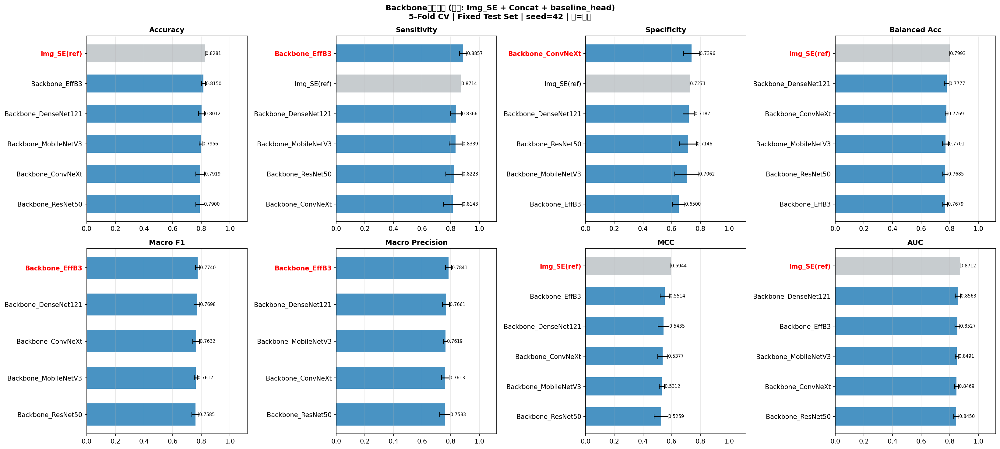
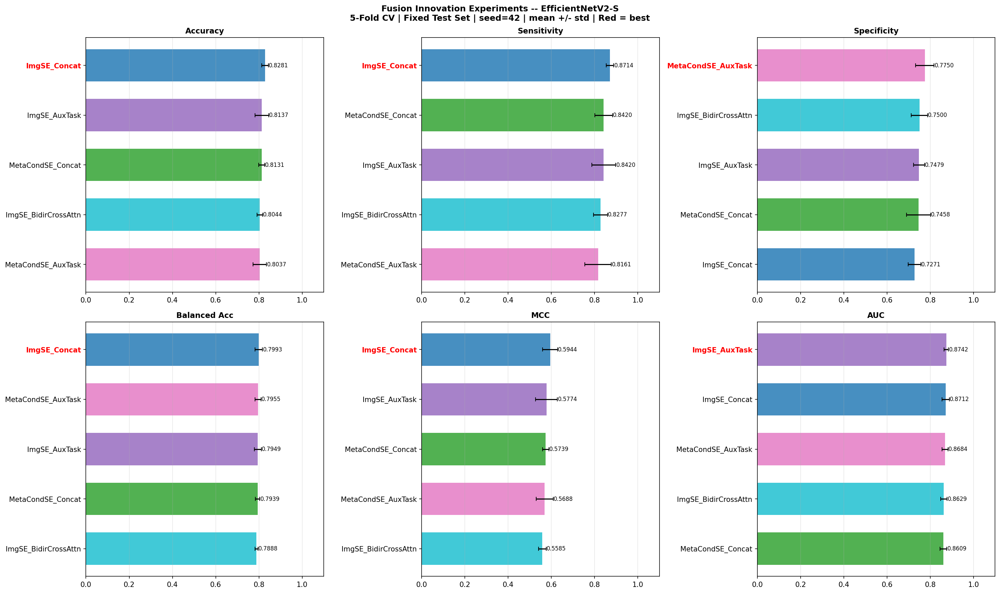
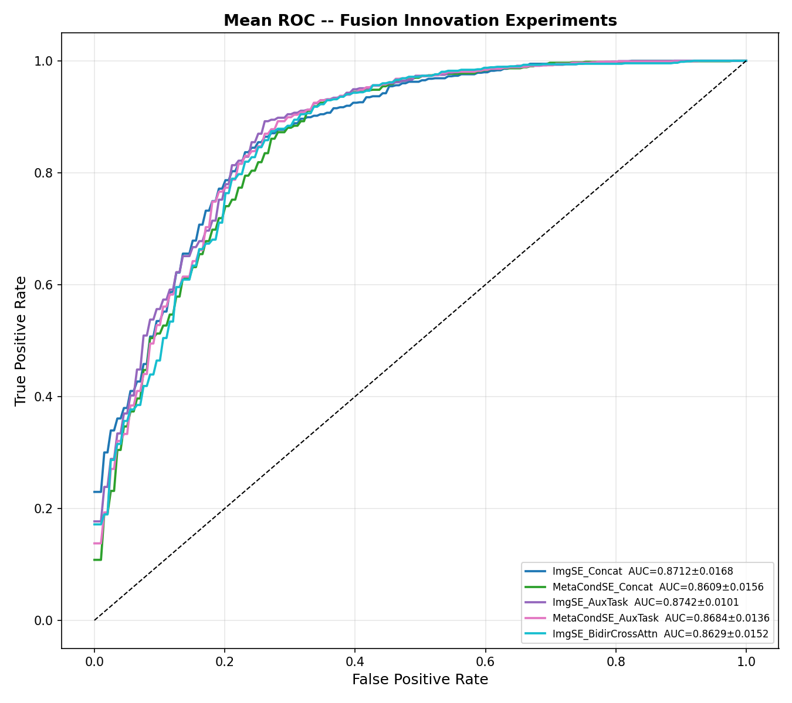
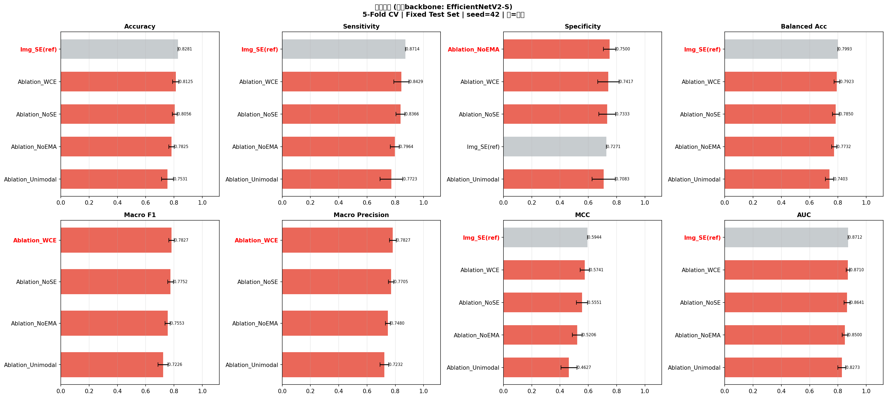

# Multimodal Recognition of Oral Cancer Integrating SE Attention and Metadata

[中文论文](paper/%E8%9E%8D%E5%90%88SE%E6%B3%A8%E6%84%8F%E5%8A%9B%E4%B8%8E%E5%85%83%E6%95%B0%E6%8D%AE%E7%9A%84%E5%8F%A3%E8%85%94%E7%99%8C%E5%A4%9A%E6%A8%A1%E6%80%81%E8%AF%86%E5%88%AB(3).docx)

## Overview

A two-stage multimodal diagnostic pipeline for oral cancer screening:

1. **Stage 1 — Oral Region Segmentation**: ResNet18-UNet extracts stable ROI from clinical oral images (**Dice: 0.9700**)
2. **Stage 2 — Multimodal Classification**: EfficientNetV2-S + SE channel attention + clinical metadata fusion with EMA & weighted label smoothing

### Model Architecture

```
Input: Oral ROI Image (448×448) + Clinical Metadata (5-dim)
       │                                    │
       ▼                                    ▼
EfficientNetV2-S (1280d)            MetaMLP (5→128→256)
       │                                    │
SE Block (channel recalibration)           │
       │                                    │
       └────────── Concat ─────────────────┘
                       │
                       ▼
              FC (1536→1024→512→256→2)
                       │
                       ▼
               Benign / Malignant
```

---

## Results

### Table 1: Training Configuration

| Parameter | Value |
|---|---|
| Training Device | NVIDIA A100 GPU |
| Random Seed | 42 |
| Input Image Size | 448 × 448 |
| Batch Size | 16 |
| Gradient Accumulation | 3 |
| Max Epochs | 100 |
| Early Stop Patience | 20 |
| Optimizer | AdamW |
| Initial Learning Rate | 2×10⁻⁴ |
| Weight Decay | 2×10⁻³ |
| LR Schedule | CosineAnnealingLR |
| Min Learning Rate | 5×10⁻⁷ |

### Table 2: Backbone Comparison

| Backbone | Accuracy | Macro F1 | MCC | AUC |
|---|---|---|---|---|
| **EfficientNetV2-S** | **0.8281 ± 0.0153** | **0.7969 ± 0.0175** | **0.5944 ± 0.0346** | **0.8712 ± 0.0168** |
| EfficientNet-B3 | 0.8150 ± 0.0140 | 0.7740 ± 0.0156 | 0.5514 ± 0.0321 | 0.8527 ± 0.0173 |
| DenseNet121 | 0.8012 ± 0.0215 | 0.7698 ± 0.0203 | 0.5435 ± 0.0388 | 0.8563 ± 0.0182 |
| MobileNetV3-Large | 0.7956 ± 0.0100 | 0.7617 ± 0.0106 | 0.5312 ± 0.0184 | 0.8491 ± 0.0102 |
| ConvNeXt-Tiny | 0.7919 ± 0.0305 | 0.7632 ± 0.0236 | 0.5377 ± 0.0352 | 0.8469 ± 0.0136 |
| ResNet50 | 0.7900 ± 0.0280 | 0.7585 ± 0.0235 | 0.5259 ± 0.0488 | 0.8450 ± 0.0182 |




### Table 3: Fusion Strategy Comparison

| Fusion Method | Accuracy | Macro F1 | MCC | AUC |
|---|---|---|---|---|
| **Concat** | **0.8281 ± 0.0153** | **0.7969 ± 0.0175** | **0.5944 ± 0.0346** | **0.8712 ± 0.0168** |
| Gated Multimodal Fusion | 0.8231 ± 0.0208 | 0.7932 ± 0.0217 | 0.5888 ± 0.0418 | 0.8728 ± 0.0218 |
| Multi-Task Learning | 0.8137 ± 0.0317 | 0.7857 ± 0.0284 | 0.5774 ± 0.0504 | 0.8742 ± 0.0101 |
| Bidirectional Cross-Attention | 0.8044 ± 0.0127 | 0.7762 ± 0.0095 | 0.5585 ± 0.0174 | 0.8629 ± 0.0152 |
| Element-wise Addition | 0.7981 ± 0.0200 | 0.7687 ± 0.0144 | 0.5470 ± 0.0212 | 0.8485 ± 0.0126 |





### Table 4: Ablation Study

| Experiment | Accuracy | Macro F1 | MCC | AUC |
|---|---|---|---|---|
| **Full Model** | **0.8281 ± 0.0153** | **0.7969 ± 0.0175** | **0.5944 ± 0.0346** | **0.8712 ± 0.0168** |
| Weighted CE (no label smoothing) | 0.8125 ± 0.0217 | 0.7827 ± 0.0186 | 0.5741 ± 0.0323 | 0.8710 ± 0.0117 |
| No SE-Block | 0.8056 ± 0.0178 | 0.7752 ± 0.0200 | 0.5551 ± 0.0395 | 0.8641 ± 0.0209 |
| No EMA | 0.7825 ± 0.0183 | 0.7553 ± 0.0182 | 0.5206 ± 0.0345 | 0.8500 ± 0.0198 |
| Unimodal (Image Only) | 0.7531 ± 0.0420 | 0.7226 ± 0.0352 | 0.4627 ± 0.0564 | 0.8273 ± 0.0279 |
| Unimodal (Metadata Only) | 0.7687 ± 0.0551 | 0.7371 ± 0.0474 | 0.4888 ± 0.0837 | 0.8188 ± 0.0115 |




### Fig.6: Grad-CAM Visualization (NoSE vs WithSE)

Channel attention (SE module) concentrates activation on lesion regions, suppressing background noise.


---

## Repository Structure

```
├── paper/                          # Paper manuscript
├── data/                           # Metadata CSVs (images not included)
├── src/
│   ├── segmentation.py             # ResNet18-UNet oral segmentation
│   ├── train_img_se_baseline.py    # Baseline: ImgSE + Concat + EMA + WLS
│   ├── train_backbone_ablation.py  # Backbone comparison & ablation study
│   ├── train_meta_only.py          # Metadata-only model
│   ├── generate_meta_npy.py        # Generate test predictions for meta-only
│   ├── train_fusion_innovation.py  # Fusion strategy comparison experiments
│   ├── train_fusion_gated.py       # ImgSE + Gated fusion
│   ├── train_fusion_add.py         # ImgSE + Add fusion
│   └── plot_roc_curves.py          # ROC curve plotting
├── results/
│   ├── tables/                     # Per-fold CSV results
│   └── figures/                    # Comparison charts, ROC curves, Grad-CAM
└── requirements.txt
```

---

## Training Strategy

- **Loss**: Weighted Label Smoothing (w=[2,1], smoothing=0.05)
- **EMA**: decay=0.99, warmup=5 epochs
- **Optimizer**: AdamW (lr=2e-4, wd=2e-3) + CosineAnnealingLR
- **Early Stopping**: patience=20, smooth_window=5
- **Data Split**: Patient-level stratified, 15% holdout test set, 5-fold CV
- **Augmentation**: Random H/V flip, rotation (±20°), affine, color jitter, grayscale
- **TTA**: 3-way flip averaging at inference

---

## Dataset

This project uses the **Dataset of Annotated Oral Cavity Images for Oral Cancer Detection** by Piyarathne et al. (2024):

- 3,000 clinical oral cavity images (Benign / OPMD / Oral Cancer)
- Oral region & lesion segmentation annotations
- Patient metadata: Age, Gender, Smoking, Chewing Betel Quid, Alcohol

**Images are not included** in this repository. Obtain the original dataset from:

> Piyarathne N S, Liyanage S N, Rasnayaka R M S G K, et al. A comprehensive dataset of annotated oral cavity images for diagnosis of oral cancer and oral potentially malignant disorders[J]. Oral Oncology, 2024, 156: 106946.

---

## Citation

> 侯宇欣, 徐睿杰, 韩俊杰, 赵奎璋, 查鑫悦, 张琥, 吴贯锋. 融合SE注意力与元数据的口腔癌多模态识别[J].

## Authors

- Hou Yuxin, Xu Ruijie, Han Junjie, Zhao Kuizhang, Zha Xinyue
- School of Mathematics, Southwest Jiaotong University
- The Third People's Hospital of Chengdu
